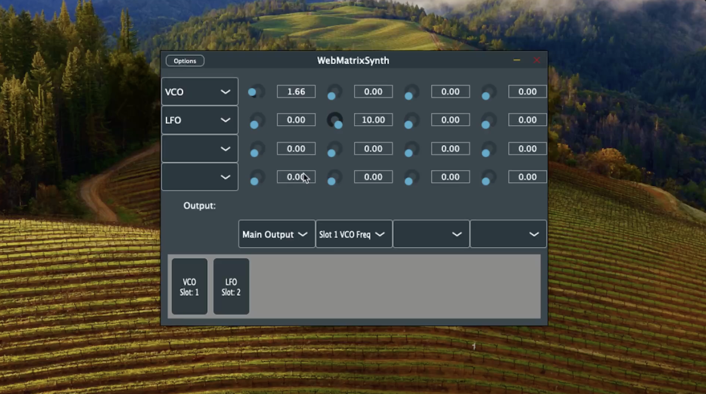
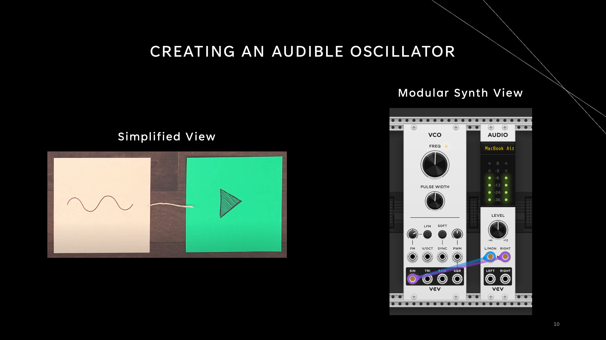
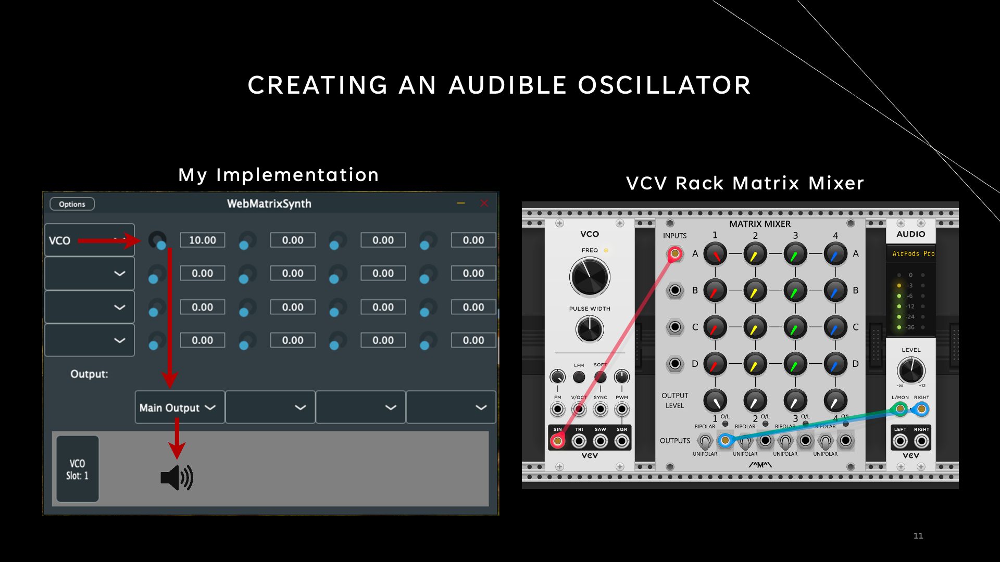
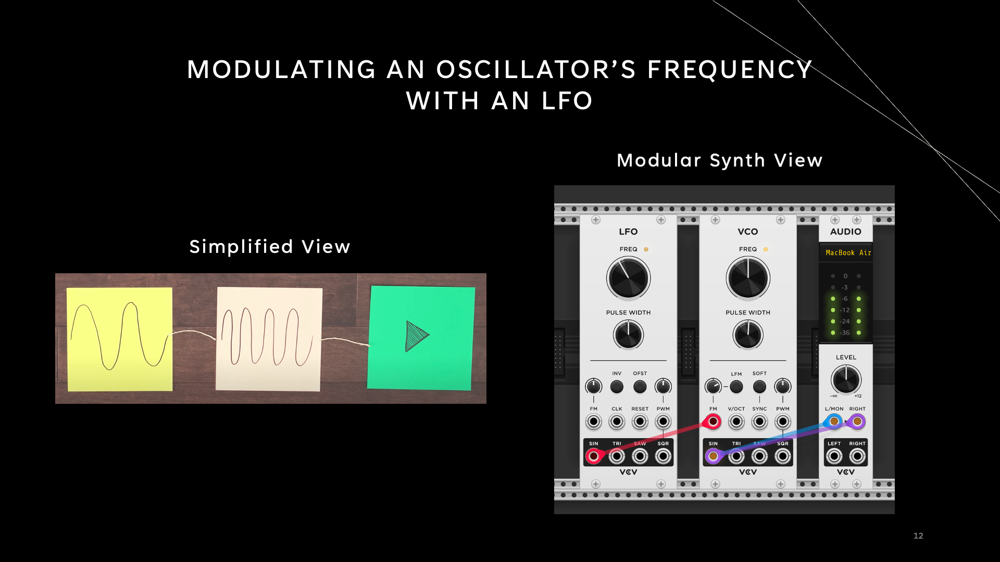
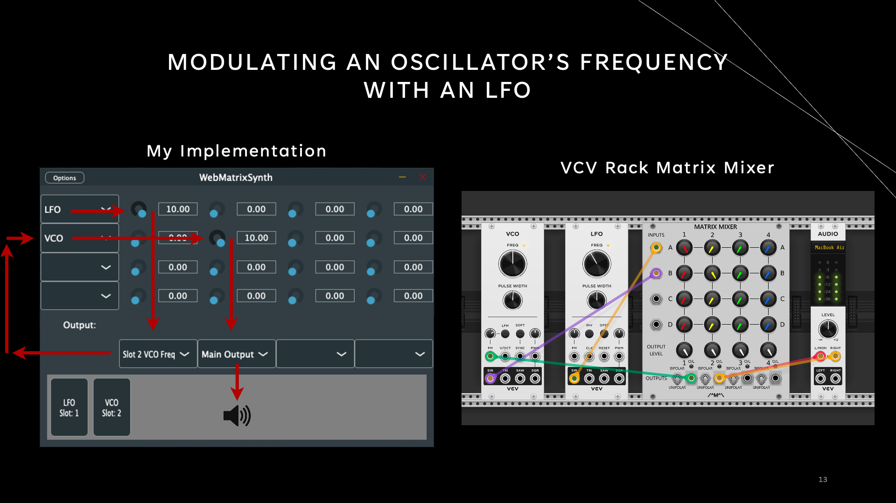

# A Modular Matrix Based Synthesizer

## This project is a modular synthesiser built around the matrix mixer architecture, built using the JUCE framework. 

What makes matrix synths so powerful in the context of modular software synths is that they merge only the positives of both fixed and modular synth architectures.

Fixed Synths (e.g. Minimoog):
* (+) Easy to opperate as they have only one fixed interface with all the routing pre soldered.
* (-) Limited in creative freedom because of this pre soldered design choice (modules cannot be swapped in and out or routed in different ways).

Modular Synths (e.g. Eurorack):
* (+) Due to the sheer number of modules avalible and ways in which modules can be routed together, the creative posiblities for modular synths is far greater than fixed synths.
* (-) Are complex to opperate due to the patch cable routing between each module and because of this are not portable.

Modular matrix synths on the other hand still keep the synth modular (preserving the customizability element) but also remove the need for messy patch cable configurations, making them more approachable and less confusing. This factor lends itself very nicely to the digital space as we do not have the luxury of having the physical space of normal modular synth racks on a screen that as developers, we do not know the size of ahead of time.

Another big benefit to modular matrix synths over traditional modular synths is the more unpredictable, creative exploration this architecture offers through the ability to create complex routing between the modules. This is extremely useful, especially to sound designers and producers who are constantly on the lookout for music technology that generates them tones and timbres that allows their music to stand out from the norm. 

## Watch the demo video

## Regular modular synths and their matrix mixer counterparts 

To help better understand how the modular matrix mixer architecture works vs standard patch cable routed modular synths I have included what the same designed synth would look like in both architectures.

